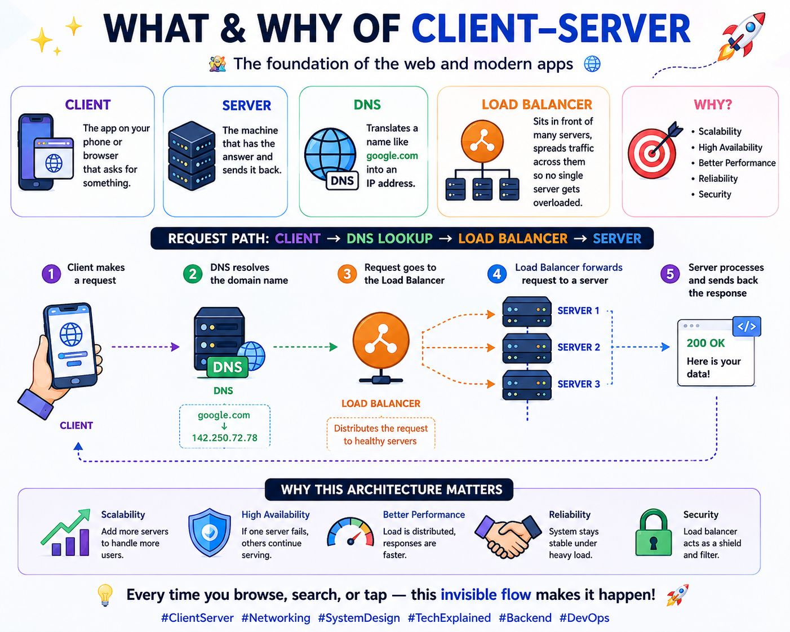

# System Design & Backend Fundamentals: Complete Learning Series

## 📚 Table of Contents
1. [Client-Server Architecture Basics](#client-server-architecture-basics)
2. [The Request Flow](#the-request-flow)
3. [Core Components](#core-components)
4. [Why This Architecture Matters](#why-this-architecture-matters)
5. [Basic Concepts](#basic-concepts)
6. [Intermediate Concepts](#intermediate-concepts)
7. [Advanced Concepts](#advanced-concepts)
8. [Next Steps](#next-steps)

---

## Client-Server Architecture Basics

### What is Client-Server Architecture?

Client-Server is a **distributed application architecture** that partitions tasks between:
- **Clients**: Request services or resources
- **Servers**: Provide services or resources

This is the fundamental model behind every web application, mobile app, and modern software system you use daily.

### Visual Overview


---

## The Request Flow

Every time you **browse, search, or tap** on an app, an invisible flow happens:

### Step-by-Step Request Path:
**CLIENT → DNS LOOKUP → LOAD BALANCER → SERVER**

#### **Step 1️⃣: Client Makes a Request**
- User opens browser or app
- Client sends HTTP/HTTPS request to a domain (e.g., google.com)
- Request contains: method (GET, POST, etc.), headers, body, path

#### **Step 2️⃣: DNS Resolves the Domain Name**
- **DNS (Domain Name System)** translates human-readable domain to IP address
- Example: `google.com` → `142.250.72.78`
- DNS lookup happens through recursive resolver → root nameserver → TLD → authoritative nameserver

#### **Step 3️⃣: Request Goes to Load Balancer**
- Load Balancer sits in front of multiple servers
- Acts as a **traffic distributor**
- Ensures no single server gets overloaded
- Distributes requests to healthy servers only

#### **Step 4️⃣: Load Balancer Forwards to Server**
- Selected server receives the request
- Can forward to Server 1, Server 2, or Server 3 based on:
  - Round-robin (equal distribution)
  - Least connections
  - Weighted distribution
  - IP hash
  - Resource utilization

#### **Step 5️⃣: Server Processes & Responds**
- Server processes the request
- Queries database if needed
- Formats response (200 OK, 404 Not Found, etc.)
- Sends response back through Load Balancer to Client

---

## Core Components

### 1. **CLIENT**
**What it is:** The app on your phone or browser on your computer

**Responsibilities:**
- Makes requests to servers
- Displays data received from servers
- Handles user interactions
- Maintains UI/UX

**Examples:**
- Web browsers (Chrome, Firefox, Safari)
- Mobile apps (Instagram, Twitter, YouTube)
- Desktop applications
- IoT devices

### 2. **SERVER**
**What it is:** A machine that has an answer and sends it back

**Responsibilities:**
- Receives client requests
- Processes business logic
- Accesses/stores data
- Sends responses back to clients

**Key Server Types:**
- **Web Server**: Handles HTTP requests (Apache, Nginx)
- **Application Server**: Runs business logic (Node.js, Java, Python)
- **Database Server**: Stores and retrieves data
- **File Server**: Manages file storage and access

### 3. **DNS (Domain Name System)**
**What it is:** The "phonebook" of the internet

**How it works:**
- Translates domain names to IP addresses
- Hierarchical system: Root → TLD → Authoritative Nameserver
- Cached at multiple levels for performance

**DNS Record Types:**
- **A Record**: Maps domain to IPv4 address
- **AAAA Record**: Maps domain to IPv6 address
- **CNAME Record**: Creates alias for another domain
- **MX Record**: Mail exchange records
- **TXT Record**: Text records for verification

### 4. **LOAD BALANCER**
**What it is:** Traffic cop that distributes requests across servers

**Why it's needed:**
- Prevents single server overload
- Improves response time
- Provides high availability
- Enables horizontal scaling

**Load Balancing Algorithms:**
- **Round Robin**: Distribute requests equally
- **Least Connections**: Route to server with fewest active connections
- **Weighted Round Robin**: Distribute based on server capacity
- **IP Hash**: Route based on client IP (sticky sessions)
- **Least Response Time**: Route to server with fastest response

**Types of Load Balancers:**
- Layer 4 (Transport Layer): TCP/UDP based
- Layer 7 (Application Layer): HTTP/HTTPS based

---

## Why This Architecture Matters

### 🔹 **Scalability**
- Add more servers as user base grows
- Horizontal scaling: Add servers, not bigger servers
- Handle millions of concurrent users

### 🔹 **High Availability**
- If one server fails, others continue serving
- No single point of failure
- System stays online 24/7/365

### 🔹 **Better Performance**
- Load distributed across multiple servers
- Reduced latency
- Faster response times
- Caching at multiple levels

### 🔹 **Reliability**
- System designed to handle failures gracefully
- Health checks detect unhealthy servers
- Automatic failover mechanisms

### 🔹 **Security**
- Load balancer acts as shield/firewall
- Filters malicious traffic
- Hides actual server details
- Single point for security policies

---

## Basic Concepts

### HTTP/HTTPS Protocol
**HTTP (HyperText Transfer Protocol):** Stateless protocol for transferring web data

**Request Format:**
```
GET /api/users HTTP/1.1
Host: api.example.com
Content-Type: application/json
Authorization: Bearer token123
```

**Response Format:**
```
HTTP/1.1 200 OK
Content-Type: application/json
Content-Length: 256

{"id": 1, "name": "John", "email": "john@example.com"}
```

**HTTP Methods:**
- **GET**: Retrieve data (safe, idempotent)
- **POST**: Create new resource
- **PUT**: Update entire resource
- **PATCH**: Partial update
- **DELETE**: Remove resource
- **HEAD**: Like GET but no response body

**Status Codes:**
- **2xx (Success)**: 200 OK, 201 Created, 204 No Content
- **3xx (Redirect)**: 301 Moved, 302 Found, 304 Not Modified
- **4xx (Client Error)**: 400 Bad Request, 401 Unauthorized, 404 Not Found, 429 Too Many Requests
- **5xx (Server Error)**: 500 Internal Server Error, 502 Bad Gateway, 503 Service Unavailable

### IP Addresses & Ports
**IP Address:** Unique identifier for devices on network
- IPv4: 192.168.1.1 (32-bit)
- IPv6: 2001:0db8:85a3::8a2e:0370:7334 (128-bit)

**Ports:** Virtual points where connections start
- HTTP: Port 80
- HTTPS: Port 443
- Database (MySQL): Port 3306
- Database (PostgreSQL): Port 5432

### Request-Response Cycle
```
Client sends Request → Network → Server processes → Server sends Response → Network → Client receives
```

---

## Intermediate Concepts

### Database Fundamentals

#### **Relational Databases (SQL)**
Store data in structured tables with relationships

**Characteristics:**
- ACID properties (Atomicity, Consistency, Isolation, Durability)
- Structured schema
- Strong consistency
- Joins enable complex queries

**Popular Options:**
- MySQL
- PostgreSQL
- Oracle Database
- SQL Server

#### **Non-Relational Databases (NoSQL)**
Store data in flexible formats

**Types:**
- **Document Database**: MongoDB, CouchDB (JSON-like documents)
- **Key-Value Store**: Redis, Memcached (simple key→value)
- **Wide Column**: Cassandra, HBase (distributed columns)
- **Graph Database**: Neo4j (relationships between entities)

**Characteristics:**
- Eventually consistent
- Horizontal scaling
- Flexible schema
- High performance for specific use cases

### Caching Strategies

**What is Caching?** Store frequently accessed data in fast storage

**Cache Levels:**
1. **Browser Cache**: Client-side caching
2. **CDN Cache**: Edge servers cache content
3. **Application Cache**: Redis/Memcached
4. **Database Cache**: Query result caching

**Cache Patterns:**

**Cache-Aside (Lazy Loading)**
```
Check Cache → Hit: Return
         → Miss: Query DB → Store in Cache → Return
```
Pros: Simple, loads on demand
Cons: Cache miss penalty

**Write-Through**
```
Write to Cache AND Database simultaneously
```
Pros: Data consistency, no stale data
Cons: Slower writes

**Write-Behind (Write-Back)**
```
Write to Cache → Asynchronously write to Database
```
Pros: Fast writes
Cons: Risk of data loss if cache fails

### API Design

**REST (Representational State Transfer)**
Architectural style using HTTP methods

**RESTful Principles:**
- Resources identified by URLs
- Standard HTTP methods (GET, POST, PUT, DELETE)
- Stateless
- Client-Server separation

**Example REST API:**
```
GET    /api/v1/users          → Get all users
GET    /api/v1/users/:id      → Get user by ID
POST   /api/v1/users          → Create new user
PUT    /api/v1/users/:id      → Update user
DELETE /api/v1/users/:id      → Delete user
```

**GraphQL**
Query language for APIs

**Advantages over REST:**
- Fetch exactly what you need
- Single endpoint
- Strongly typed schema
- Built-in introspection

### Authentication & Authorization

**Authentication:** Who are you? (Identity verification)
- Username/Password
- OAuth 2.0
- JWT (JSON Web Tokens)
- OpenID Connect

**Authorization:** What can you do? (Permission checking)
- Role-Based Access Control (RBAC)
- Attribute-Based Access Control (ABAC)
- ACL (Access Control Lists)

**JWT Token Flow:**
```
1. User logs in with credentials
2. Server validates & creates JWT token
3. Server returns token to client
4. Client includes token in subsequent requests
5. Server validates token signature
6. Server grants access if valid
```

---

## Advanced Concepts

### Distributed Systems

**Challenge:** Multiple computers must work together seamlessly

**Key Problems:**
- **Network Failures**: Servers can't reach each other
- **Latency**: Messages take time to travel
- **Inconsistency**: Replicas may have different data
- **Concurrency**: Multiple operations happening simultaneously

### Microservices Architecture

**Evolution from Monolith:**
```
Monolith: Single large app handling all logic
    ↓ (Scalability Issues)
Microservices: Multiple independent services, each handles one business capability
```

**Benefits:**
- Independent scaling
- Technology flexibility
- Faster deployment
- Team autonomy

**Challenges:**
- Distributed debugging
- Inter-service communication
- Data consistency
- Operational complexity

**Service Communication:**
- **Synchronous**: REST API, gRPC (request-response)
- **Asynchronous**: Message Queues, Event Streaming

### Message Queues & Event-Driven Architecture

**Problem:** Tight coupling between services

**Solution:** Message Broker decouples services

**How it works:**
```
Service A → Message Broker → Service B
           (Kafka, RabbitMQ)
```

**Benefits:**
- Asynchronous processing
- Decoupled services
- Better resilience
- Handles traffic spikes

**Use Cases:**
- Email notifications
- Image processing
- Fraud detection
- Analytics processing

### Scalability Patterns

#### **Vertical Scaling**
Increase power of existing server (more CPU, RAM)

**Pros:** Simple
**Cons:** Limited ceiling, expensive, causes downtime

#### **Horizontal Scaling**
Add more servers

**Pros:** Unlimited scaling, high availability
**Cons:** Complexity, data consistency challenges

**Horizontal Scaling Requirements:**
- Stateless servers
- Load balancer
- Session management
- Database replication

### High Availability & Redundancy

**Key Concepts:**

**Replication**
- Copy data across multiple servers
- Master-Slave: One primary, multiple replicas
- Master-Master: Multiple primaries
- Multi-region: Replicate across geographic regions

**Failover**
- Automatic detection of failures
- Automatic switching to backup
- Health checks every few seconds

**Availability Metric: Uptime Percentage**
```
99% uptime = 3.65 days downtime/year
99.9% uptime = 8.76 hours downtime/year (Three 9s)
99.99% uptime = 52.6 minutes downtime/year (Four 9s)
99.999% uptime = 5.26 minutes downtime/year (Five 9s)
```

### Consistency Patterns

**CAP Theorem:** Consistency, Availability, Partition Tolerance - pick 2

#### **Strong Consistency**
- All nodes have same data at same time
- Sacrifices availability during network partitions
- Used in: Banks, critical systems

#### **Eventual Consistency**
- Nodes eventually converge to same state
- High availability
- Used in: Social media, caching

#### **Causal Consistency**
- Related operations maintain order
- Middle ground between strong & eventual

### Monitoring, Logging & Observability

**Metrics:** Quantitative measurements
- CPU usage, memory, disk space
- Request latency, error rate
- Database query time
- Cache hit ratio

**Logging:** Record events happening in system
- Application logs
- Server logs
- Access logs
- Error logs

**Distributed Tracing:** Track request through microservices
- Generate unique trace ID
- Pass trace ID across services
- Reconstruct complete request flow

**Tools:**
- Prometheus (metrics)
- ELK Stack (logging)
- Jaeger (tracing)
- Grafana (visualization)

### Caching at Scale

**Multi-Level Caching:**
```
Browser Cache → CDN Cache → App Cache (Redis) → Database Cache → Database
```

**Cache Invalidation Strategies:**
- Time-based (TTL)
- Event-based (invalidate on update)
- LRU (Least Recently Used)
- LFU (Least Frequently Used)

**Distributed Caching:**
- Redis Cluster: Data sharded across nodes
- Redis Replication: High availability with sentinel
- Memcached: Simple distributed cache

### API Gateway Pattern

**What is it?** Single entry point for all client requests

**Responsibilities:**
- Request routing
- Protocol translation
- Authentication
- Rate limiting
- Load balancing
- Response transformation

**Benefits:**
- Decouples clients from services
- Centralized cross-cutting concerns
- API versioning
- Security enforcement

---

## Advanced Implementation Patterns

### Database Sharding

**Problem:** Single database becomes bottleneck

**Solution:** Distribute data across multiple databases

**Sharding Strategies:**
- **Range-based**: Shard by date range
- **Hash-based**: Hash key determines shard
- **Directory-based**: Lookup table maps to shard
- **Geographic**: Different regions

**Challenges:**
- Join operations across shards
- Rebalancing when scaling
- Hot shards (uneven distribution)

### Event Sourcing

**Concept:** Store sequence of events instead of current state

**How it works:**
```
Event 1: UserCreated(john@example.com)
Event 2: SubscriptionActivated(plan=pro)
Event 3: PaymentProcessed(amount=$9.99)
↓
Current State: User John with Pro subscription
```

**Benefits:**
- Complete audit trail
- Replay events to rebuild state
- Temporal queries

### CQRS (Command Query Responsibility Segregation)

**Concept:** Separate read and write models

**Architecture:**
```
Writes → Command Model (optimize for writes) → Event Store
Reads ← Query Model (optimize for reads, eventual consistency)
```

**Benefits:**
- Optimize for different access patterns
- Independent scaling
- Better performance

### Circuit Breaker Pattern

**Problem:** Cascading failures when service is down

**Solution:** Circuit breaker detects failures and "opens"

**States:**
- **Closed**: Normal, requests pass through
- **Open**: Too many failures, requests rejected
- **Half-Open**: Testing if service recovered

**Benefits:**
- Prevents cascading failures
- Fast failure detection
- Graceful degradation

---

## Industry Best Practices

### Design Principles

1. **Separation of Concerns**: Each component has single responsibility
2. **Stateless Services**: Easy to scale horizontally
3. **Idempotency**: Same operation repeated has same effect
4. **Defense in Depth**: Multiple security layers
5. **Fail Fast**: Detect issues early
6. **Observable**: Log, monitor, trace everything

### Performance Optimization

- Use caching aggressively
- Optimize database queries (indexes, query plans)
- Compress responses (gzip)
- Use CDN for static content
- Implement connection pooling
- Batch requests when possible
- Use compression algorithms

### Security Best Practices

- Always use HTTPS
- Validate all inputs
- Sanitize database queries (prevent SQL injection)
- Rate limiting on APIs
- Regular security audits
- Encrypt sensitive data at rest and in transit
- Use secure password hashing (bcrypt, scrypt)
- Implement CSRF protection
- Keep dependencies updated

---

## Real-World Architecture Examples

### E-commerce Platform (Amazon-like)
```
Clients (Web, Mobile, Desktop)
        ↓
    API Gateway
    ↓         ↓         ↓
Product   Order    Payment
Service   Service  Service
    ↓         ↓         ↓
Product DB  Order DB  Payment DB
        ↓
    Kafka Queue
    ↓         ↓
Notification  Analytics
Service       Service
```

### Social Media Platform (Instagram-like)
```
Clients
    ↓
Load Balancer
    ↓ ↓ ↓
Web Servers
    ↓
API Gateway
    ↓ ↓ ↓ ↓
Auth    Feed    Upload  Search
Service Service Service Service
    ↓
Redis Cache
    ↓
PostgreSQL + Cassandra (for time-series feeds)
    ↓
S3 (Image Storage)
    ↓
Elasticsearch (for search)
    ↓
Message Queue
    ↓ ↓ ↓
Notifications, Analytics, Machine Learning
```

---

## Next Learning Topics

### 🔹 **Level 1: Foundations** (Current)
- ✅ Client-Server Architecture
- ✅ DNS & Load Balancing
- ✅ Basic HTTP/HTTPS
- ✅ Request-Response Cycle

### 🔹 **Level 2: Database & Caching**
- Relational vs Non-Relational Databases
- Database Indexing & Query Optimization
- Caching Strategies (Redis, Memcached)
- Database Replication & Sharding

### 🔹 **Level 3: API & Communication**
- REST API Design
- GraphQL Basics
- gRPC & Protocol Buffers
- WebSockets & Real-time Communication

### 🔹 **Level 4: Security & Authentication**
- JWT Authentication
- OAuth 2.0 & OpenID Connect
- SSL/TLS & HTTPS
- Rate Limiting & DDoS Protection

### 🔹 **Level 5: Distributed Systems**
- CAP Theorem & Consistency Models
- Consensus Algorithms (Raft, Paxos)
- Distributed Transactions
- Service Mesh (Istio, Linkerd)

### 🔹 **Level 6: Scalability & Performance**
- Horizontal vs Vertical Scaling
- Database Sharding
- CDN & Edge Computing
- Performance Monitoring & Optimization

### 🔹 **Level 7: Advanced Patterns**
- Microservices Architecture
- Event-Driven Architecture
- CQRS & Event Sourcing
- Saga Pattern for Distributed Transactions

### 🔹 **Level 8: DevOps & Deployment**
- Docker & Containerization
- Kubernetes Orchestration
- CI/CD Pipelines
- Infrastructure as Code

---

## Quick Reference Cheat Sheet

### Key Terms
| Term | Definition |
|------|-----------|
| **Client** | Device or application requesting service |
| **Server** | Machine providing service/resource |
| **DNS** | System translating domain names to IP addresses |
| **Load Balancer** | Distributes traffic across multiple servers |
| **Cache** | Fast storage for frequently accessed data |
| **API** | Interface defining how services communicate |
| **Microservice** | Small, independent service doing one thing well |
| **Replica** | Copy of data on another server |
| **Failover** | Automatic switch to backup system |
| **Latency** | Time delay in request-response cycle |
| **Throughput** | Number of requests processed per unit time |
| **Availability** | System uptime percentage (99.9%, etc.) |

### Important Ports
```
80    → HTTP
443   → HTTPS
3306  → MySQL
5432  → PostgreSQL
6379  → Redis
5672  → RabbitMQ
27017 → MongoDB
8080  → Common app server port
```

### HTTP Status Code Quick Reference
```
200 OK, 201 Created, 204 No Content
301 Moved Permanently, 302 Found, 304 Not Modified
400 Bad Request, 401 Unauthorized, 403 Forbidden, 404 Not Found, 429 Too Many Requests
500 Internal Server Error, 502 Bad Gateway, 503 Service Unavailable
```

---

## Key Takeaways

1. **Client-Server is foundational** - Understand it deeply before moving to distributed systems
2. **Scalability requires multiple layers** - DNS, Load Balancers, Caches, Database Replicas
3. **Trade-offs are everywhere** - Consistency vs Availability, Performance vs Cost, Simplicity vs Scalability
4. **Monitor everything** - What you can't measure, you can't improve
5. **Design for failure** - Assume components will fail and design accordingly
6. **Security is not optional** - Build it in from the start
7. **Learn by building** - Theory is important, but implementation solidifies knowledge

---

## Learning Path Recommendation

**Week 1-2:** Solidify basics (HTTP, DNS, IP, Ports)
↓
**Week 3-4:** Build simple REST API with database
↓
**Week 5-6:** Learn about caching and implement Redis
↓
**Week 7-8:** Explore databases (SQL vs NoSQL)
↓
**Week 9-10:** Study load balancing and high availability
↓
**Week 11-12:** Microservices and distributed systems
↓
**Ongoing:** Practice with real-world projects

---

**Remember:** System Design is a journey, not a destination. Every day you'll learn something new from real-world systems. Keep building, keep learning! 🚀

---


*Last Updated: July 27, 2026*
